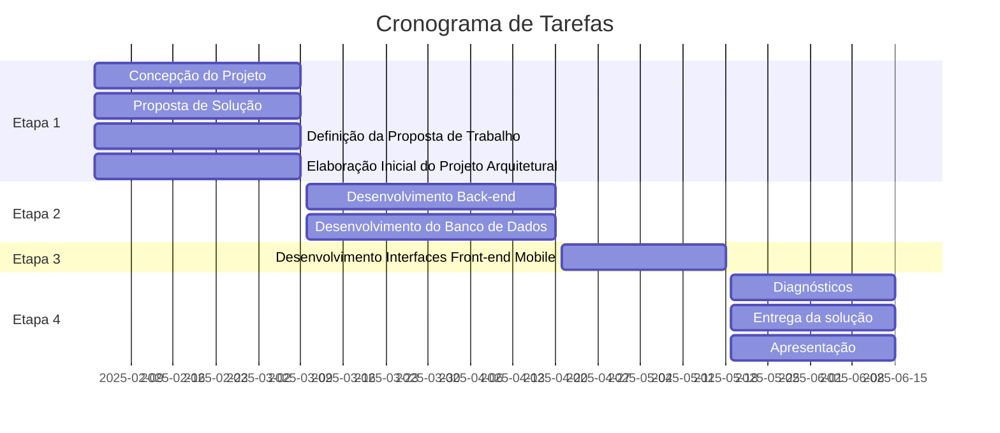

# Introdução

O projeto em questão consiste no desenvolvimento de um aplicativo móvel destinado a conectar crianças e adolescentes atípicos com trantornos do espectro autista e transtornos de aprendizado em geral a profissionais da área de psicopedagogia, dispostos a atendê-los a valores sociais ou de forma gratuita. O objetivo principal do app é facilitar o acesso ao atendimento psicopedagógico ao público alvo destinado, promovendo um impacto positivo em sua jornada educacional.

## Problema
A falta de acesso a atendimento com profissionais da área de psicopedagogia para crianças e adolescentes atípicos é um problema significativo. O custo elevado de profissionais com atendimento particular, e dos planos de saúde que cobrem este tipo de atendimento, inviabiliza o acompanhamento indispensável para este público.

## Objetivos

> **Objetivo Geral**:
> - Desenvolver um aplicativo móvel que conecte crianças e adolescentes atípicos a psicopedagogos dispostos a realizar atendimento particular voluntário ou a custo social.
> > **Objetivos Específicos**:
> - Facilitar o agendamento de consultas presenciais, considerando a disponibilidade dos profissionais e a proximidade geográfica entre as partes.
> - Oferecer aos profissionais uma plataforma para ganhar experiência e contribuir com a sociedade.
 
## Justificativa

A criação deste aplicativo é justificada pela necessidade de ampliar o acesso a serviços de psicopedagogia para famílias carentes. Ao conectar essas famílias a profissionais disponíveis, o app não apenas promove o desenvolvimento pedagógico, mas também fortalece a responsabilidade social dos profissionais envolvidos, além do ganho de experiência na área, atributo importante no desenvolvimento da carreira profissional.

## Relação com a Extensão Universitária

A Extensão Universitária é um dos pilares fundamentais da universidade, ao lado do ensino e da pesquisa, e tem como objetivo promover a interação entre a instituição de ensino e a sociedade, contribuindo para a transformação social e o desenvolvimento comunitário. O projeto do aplicativo móvel para conectar as famílias a profissionais especializados está alinhado com os princípios da Extensão Universitária, uma vez que busca resolver uma situação-problema de relevância social e promover um impacto positivo na comunidade, além de beneficiar diretamente os profissionais envolvidos.

## Descrição do Parceiro

O parceiro é um profissional regulamentado na área de psicopedagogia, que realiza regularmente atendimentos particulares e também em clínicas conveniadas a planos de saúde. Não somente a esse parceiro, o app visa atender uma demanda generalizada, sendo útil também a profissionais com perfil semelhante.

## Gerenciamento de Cronograma
### Cronograma de Tarefas

