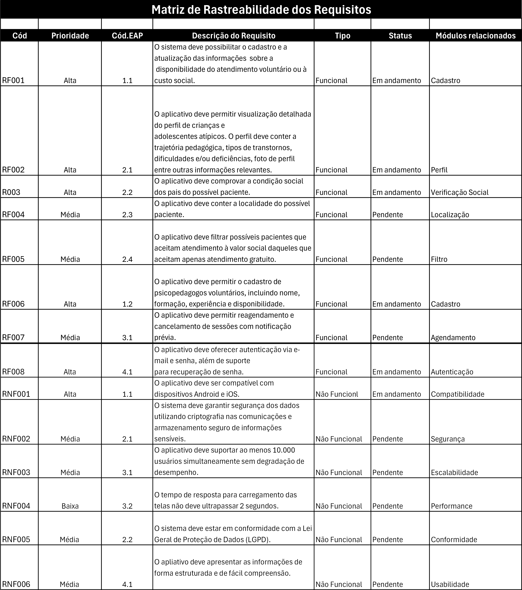

# Especificações do Projeto

Através de pesquisas de campo dentro do público alvo do projeto, foram estipuladas as personas que seguem juntamente de suas histórias de usuário, dando origem aos requisitos funcionais e não funcionais da aplicação.

## Personas

### Natalia Almeida


Formada em pedagogia com pós em psicopedagogia e pós em edução especial e inclusiva.

| MOTIVAÇÕES                                                                                                                                                                                                                      | FRUSTRAÇÕES                                                                                                                                                                                                                                                                                                                                                                                                                                | HOBBIES / HISTÓRIA                                                                                                                                                                                                                                         |
| ------------------------------------------------------------------------------------------------------------------------------------------------------------------------------------------------------------------------------- | ------------------------------------------------------------------------------------------------------------------------------------------------------------------------------------------------------------------------------------------------------------------------------------------------------------------------------------------------------------------------------------------------------------------------------------------ | ---------------------------------------------------------------------------------------------------------------------------------------------------------------------------------------------------------------------------------------------------------- |
| Natalia é apaixonada por ajudar e cuidar de quem mais precisa, tendo grande empatia por causas sociais e pessoas em situação de vulnerabilidade. Suas motivações a fizeram seguir na área da edução, que posteriormente foi especializada à edução inclusiva. |Além dos atendimentos particulares em clínicas e à domicílio, Natalia gostaria de ampliar sua participação social atendendo gratuitamente ou a custo social crianças e adolescentes em situação de vulnerabilidade financeira. Além de ampliar sua experiência na área, faz parte das suas motivações a inclusão. Porém ela não encontra com facilidade canais de comunicação para se conectar a este público, sendo necessário uma ferramenta de uso intuitivo e de baixo custo necessária para este fim.| Inicialmente influenciada pela família, Natalia decidiu seguir a área da educação com foco em concursos público, entretanto, ao decorrer de sua jornada se deparou com crianças e adolescentes com deficiências intelectuais e do especto autista, e sentiu que poderia fazer mais por esse público. Sendo assim, se especializou em psicopedagogia e posteriormente em educação especial e inclusiva.|

---

### Márcio José


Pedreiro autonomo pai de um filho atípico (transtorno do espectro autista).

| MOTIVAÇÕES                                                                                                                                                                                                                      | FRUSTRAÇÕES                                                                                                                                                                                                                                                                                                                                                                                                                                | HOBBIES / HISTÓRIA                                                                                                                                                                                                                                         |
| ------------------------------------------------------------------------------------------------------------------------------------------------------------------------------------------------------------------------------- | ------------------------------------------------------------------------------------------------------------------------------------------------------------------------------------------------------------------------------------------------------------------------------------------------------------------------------------------------------------------------------------------------------------------------------------------ | ---------------------------------------------------------------------------------------------------------------------------------------------------------------------------------------------------------------------------------------------------------- |
|Márcio é pai solteiro de seu filho Gabriel. Sua esposa faleceu quando Gabriel tinha poucos anos de vida, e desde então a principal motivação de Márcio tem sido garantir a melhor educação e condição de vida possível a seu filho.| Seu filho nasceu um transtorno do espectro autista de nível 1 de suporte. Mesmo sendo o nível de menor suporte do transtorno, o acompanhamento com profissionais da área de psicopedagogia é essencial para garantir o melhor aproveitamento pedagógico, entretanto o alto custo destes profissionais impossibilita sua contratação.| Márcio vem de uma origem humilde e sempre teve dificuldades financeiras, sua esposa veio a falecer nos primeiros anos de vida de seu filho Gabriel, que nasceu com transtorno do espectro autista de nível 1. Desde então, ele tem buscado trazer a melhor condição de vida possível a ele, investindo principalmente em sua educação, tendo em vista as limitações e dificuldades que o transtorno traz.|

---

## Histórias de Usuários

A partir da compreensão do dia a dia das personas identificadas para o projeto, foram registradas as seguintes histórias de usuários.

| EU COMO... `PERSONA` | QUERO/PRECISO ... `FUNCIONALIDADE`                                                                                          | PARA ... `MOTIVO/VALOR`                                                                                                                                                                                                                                                                                             |
| -------------------- | --------------------------------------------------------------------------------------------------------------------------- | ------------------------------------------------------------------------------------------------------------------------------------------------------------------------------------------------------------------------------------------------------------------------------------------------------------------- |
| Natalia Almeida   | Poder informar a pais ou responsáveis a disponibilidade de atendimento pedagógico para pessoas atípicas voluntário ou a custo social.                                                              |Ganhar mais experiência prática e auxiliar crianças e adolescentes em que os pais não tenham condição de pagar atendimento particular. |
| Natalia Almeida   | Encontrar em mais detalhes perfis de crianças e adolescentes atípicos que precisam de atendimento. Com uma pequena biografia da trajetória pedagógica, tipos de transtornos, dificuldades e/ou deficiências, foto de perfil entre outras informações relevantes.                                                              |Selecionar os perfis que tenho condições de atender de forma social. |
| Natalia Almeida   | Identificar e comprovar a condição social dos pais do possível paciente.                                                              |Garantir a acessibilidade a quem de fato precisa, que não tenha condições financeiras para arcar com atendimento particular ou em clínicas.|
| Natalia Almeida   | Identificar a localidade do possível paciente.                                                               |Saber se compensa mais atender no domicílio dele ou no meu. |
| Natalia Almeida   | Filtrar possíveis pacientes que aceitem atendimento a valor social daqueles que aceitem apenas atendimento gratuito.                                                              |Alinhar expectativas e possibilidades de atendimento, nem toda intervenção é possível a custo zero. |
| Márcio José  | Encontrar psicopedagogos particulares dispostos a fazer trabalho voluntário ou a custo social.                                                              |Realizar o acompanhamento pedagógico do meu filho com transtorno do espectro autista.|
| Márcio José  | Selecionar apenas profissionais próximos a minha localidade.                                                             |Optar por profissionais mais próximos, reduzindo custos com transporte.|
| Márcio José  | Visualizar a imagem de perfil, o currículo e as formações do profissional. disponível.                                                             |Garantir a seleção de um profissional regulamentado para evitar fraudes ou abusos.|
## Arquitetura e Tecnologias

O sistema segue uma arquitetura **cliente-servidor** com:
- **Backend**: Node.js + Express.js
- **Frontend**: React Native (iOS/Android)
- **Banco de Dados**: MongoDB (via Prisma ORM)

### Diagrama de Fluxo da Arquitetura


```
    A[App Mobile\nReact Native] -->|HTTPS| B[API Gateway\nExpress.js]
    B --> C[Autenticação\nJWT]
    C --> D[Banco de Dados\nMongoDB]
    C --> E[Microserviços]
    E --> E1[Usuários\nCRUD]
    E --> E2[Profissionais\nBusca/Filtros]
    E --> E3[Pacientes\nPerfis/Histórico]
```

### Tecnologias Definidas

#### 1. **Frontend (Aplicativo Mobile)**
| Componente          | Tecnologia                          |
|---------------------|-------------------------------------|
| Framework           | React Native                        |
| Navegação           | React Navigation                    |
| Gerenciamento de Estado | Context API / Redux             |
| UI/UX               | NativeBase ou React Native Paper    |


#### 2. **Backend (API RESTful)**
| Componente       | Tecnologia                  |
|------------------|-----------------------------|
| Linguagem        | JavaScript                  |
| Framework        | Express.js                  |
| Autenticação     | JWT                         |
| Upload de Imagens| Multer                      |

#### 3. **Banco de Dados**
| Componente | Tecnologia               |
|------------|--------------------------|
| SGBD       | MongoDB                  |
| ORM        | Prisma Client            |
| Cache      | Redis (Opcional)         |

#### 4. **Infraestrutura**
| Área           | Tecnologia                          |
|----------------|-------------------------------------|
| Hospedagem     | GitHub / Vercel                 |
| Banco de Dados | Mongo DB (Prisma ORM)      |
| CI/CD          | GitHub Actions                     |
|   |      |

### Fluxo de Comunicação
1. **App Mobile** → API Gateway (Express.js)  
   - Todas as requisições passam por um roteador central.
2. **Autenticação JWT**  
   - Validação para rotas privadas do backend via middleware `auth.js`.
3. **Prisma ORM** → MongoDB  
   - Consultas tipadas e seguras.

### Justificativa das Escolhas
| Tecnologia  | Vantagem                                   |
|-------------|--------------------------------------------|
| React Native| Cross-platform com código único            |
| MongoDB     | Flexível para dados semi-estruturados      |
| Prisma      | Tipagem forte + facilidade de manutenção   |
| JWT         | Autenticação stateless e escalável         |


## Requisitos

A tabela que se segue apresenta a matriz de rastreabilidade dos requisitos funcionais e não funcionais que detalham o escopo do projeto.



## Restrições

O projeto está restrito pelos itens apresentados na tabela a seguir.

|ID| Restrição                                             |
|--|-------------------------------------------------------|
|01| O projeto deverá ser apresentado e entregue até o final do 1º semestre letivo de 2025 |

## Diagrama de Casos de Uso


## Modelo ER (Projeto Conceitual)


## Projeto da Base de Dados

  

## Diagrama de arquitetura da aplicação
O diagrama abaixo representa uma arquitetura cliente-servidor baseada em uma aplicação mobile desenvolvida em React Native que se comunica com um servidor Node.js e um banco de dados MongoDB.


## Modelagem dos processos 

### Situação atual do Projeto:
No momento, o projeto conta com uma API Node.js que corresponde ao backend da nossa aplicação que está conectada a um banco de dados MongoDB.


### Situação Futura do Projeto:


## Gerenciamento de Cronograma
### Cronograma de Tarefas


### Cronograma de Custos

**Objetivo**: Planejar, controlar e monitorar gastos ao longo do tempo.

---
## Planejamento de Custos

| Ítem                        | Descrição                                          |Custo Estimado   |                 
|-----------------------------|----------------------------------------------------|-----------------|
|**Servidor na Nuvem**        |Infraestrutura de Nuvem                              |1200/mês        |
|**Banco de Dados**           |Configuração e Manutençaõ                            |1500/mês        |
|**Domínio e SSL**            |Hospedagem e segurança do app                        |100/mês         |
|**Desenvolvedores**          |Backend e Frontend                                   |6000/mês        |
|**Designer**                 |Criação da interface do usuário                      |4000/mês        |
|**Gerente de projeto**       |Coordenação do desenvolvimento                       |8000/mês        |
|**Profissional de Marketing**|Divulagação  e crescimento da base de usuários       |5000/mês        |  
|**Teste QA**                 |Testes para garantir o funcionamento correto         |5000/mês        |                
|**Total**                    |                                                     |30800/mês       |
---     

### Cronograma de Pessoal   

**Objetivo**: Definir a alocação de recursos humanos por etapa e tarefa do projeto.  

---
 
## Papéis e Responsabilidades  

| Função                   | Integrante          | Descrição                                                                 |  
|--------------------------|---------------------|---------------------------------------------------------------------------|  
| **Gerente de Projeto**    | Danilo Henrique    | Coordenação geral, prazos e comunicação com stakeholders.                |  
| **Analista de Requisitos**| Elisabete Romana   | Documentação (problema, personas, requisitos).                           |  
| **UX/UI Designer**        | Danilo Henrique    | Protótipos de telas, fluxo de navegação.                                 |  
| **Desenvolvedor Mobile**  | Alicia Ribeiro     | Programação das funcionalidades e testes unitários.                      |  
| **Desenvolvedor Back-end**| Isabella Cristina  | API, modelagem do banco de dados e rotas.                                |  
| **QA (Testador)**         | Nickolas Ribeiro   | Testes (unidade, funcionalidade, usabilidade).                           |  
| **DBA**                   | Isabella Cristina  | Modelagem e otimização do banco de dados.                                |  
---

### Cronograma por Etapa  

### **Etapa 1** -  03/02/25 a 09/03/25

| Tarefa                                                                 | Responsáveis                          | Duração      |  
|------------------------------------------------------------------------|---------------------------------------|--------------|  
| Documento de Contexto                                                  | Analista + Gerente                    | 1 semana     |  
| Especificação do Problema                                              | Analista + Gerente                    | 1 semana     |  
| Documentação dos perfis de usuários, suas necessidades e Personas.     | Gerente + Analista                    | 1 semana    |  
| Análise de Viabilidade da solução                                      | Gerente + Analista                    | 1 semana     |
| Documentação da Arquitetura Mobile                                     | Gerente                               | 3 dias     |
| Documentação dos requisitos funcionais e não funcionais do projeto de acordo com o contexto levantado| Analista              | 2 dias     |

---

### **Etapa 2** - 10/03/25 a 20/04/25

| Tarefa                                                                 | Responsáveis                          | Duração      |  
|------------------------------------------------------------------------|---------------------------------------|--------------|  
| Programação de Funcionalidades                                         | Dev Mobile                            | 1 semana    |  
| Criar tabelas, gráficos ou dashboards com no mínimo 5 indicadores de desempenho e metas para o processo de negócio| Dev Back-end | 1 semana     |  
| Planejamento de atividades com ciclo de vida atrelado aos processos    | Gerente                    | 1 semana     |  
| Definição de Banco de Dados (Relacional ou Não-Relacional)             | DBA + Dev Back-end                    | 1 semana     |  
| Documentação com a justificativa e avaliação do modelo de dados escolhido para o contexto da aplicação | Dev Back-end                          | 1 semana     |  
| Implementação das funcionalidades que envolvem o banco de dados escolhido para armazenamento e recuperação de dados | DBA + Dev Back-end | 2 dias     |  
| Implementação de rotas de acesso ao banco, preferencialmente por meio de API | DBA + Dev Back-end                    | 2 dias     |  
| Efetuar testes de unidade                                              | QA | 1 dia    |  

---

### **Etapa 3** - 21/04/25 a 18/05/25

| Tarefa                                                                 | Responsáveis                          | Duração      |  
|------------------------------------------------------------------------|---------------------------------------|--------------|  
| Documentação do projeto de interface e o fluxo de telas do sistema de uma aplicação mobile | UX Designer       | 1 semana     |  
| Implementação do projeto de interface, fluxo de telas do sistema de uma aplicação mobile e testes de unidade | Dev Mobile + UX Designer | 2 semanas    |  
| Planos de Testes de Funcionalidades e Usabilidade                      | QA + UX Designer                      | 1 semana     | 
| Registros de Testes de Funcionalidades e Usabilidade                   | QA + UX Designer                      | 1 semana     |  

---

### **Etapa 4** - 19/05/25 a 15/06/25

| Tarefa                                                                 | Responsáveis          | Duração      |  
|------------------------------------------------------------------------|-----------------------|--------------|  
| Considerações Finais                                                   | Todos                 | 2 semnas     |  
| Entrega de Vídeo de Apresentação Final e PDF usado na Apresentação     | Todos                 | 1 semana     |  
| Realização da Apresentação Final                                       | Todos                 | 1 semana     |  

 

