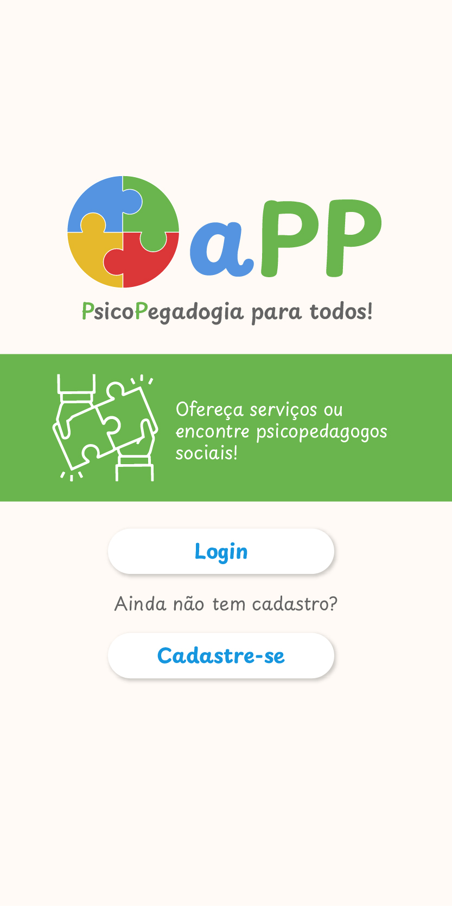
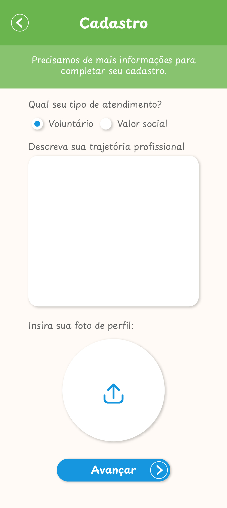

# Projeto de Interface

## Fluxo de telas da aplicação

O fluxo do usuário previsto para as telas do sistema segue no esquema abaixo:

O diagrama acima, além de exibir o fluxo de telas previsto para o usuário, conta com um índice que numera cada uma das telas do sistema a fim de identifica-las de acordo com o protótipo de alta fidelidade que segue abaixo.

### Tela 01 - Homepage

Tela inicial da aplicação

### Tela 02 - Login

Tela de login da aplicação, quando o login é bem-sucedido o Token JWT é gerado e armazenado no lado cliente para verificação nas rotas privadas.

### Tela 03 - Cadastro Usuário

Tela para cadastrar um usuário geral, dependendo da escolha do usuário no Radio Button "Paciente" ou "Psicopedagogo" a próxima tela será a especialização do perfil de acordo com essa escolha.

### Tela 04 - Cadastro Especialização Usuário Profissional

Tela para seguir com o cadastro sendo um Profissional (Psicopedagogo).

### Tela 05 - Cadastro Especialização Usuário Paciente

Tela para seguir com o cadastro sendo um Paciente.

### Tela 06 - Listagem de Profissionais Disponíveis

Tela com a listagem de profissionais disponíveis, exibida apenas para perfis do tipo Paciente. Essa é uma rota privada, apenas com um Token JWT válido é possível acessá-la. Do contrário, a API retorna status 401, não autorizado.

### Tela 07 - Listagem de Pacientes Disponíveis

Tela com a listagem de pacientes disponíveis, exibida apenas para perfis do tipo Profissional. Essa é uma rota privada, apenas com um Token JWT válido é possível acessá-la. Do contrário, a API retorna status 401, não autorizado.

### Tela 08 - Alteração Dados Perfil Profissional

Tela para alterar os dados do perfil do tipo Profissional.

### Tela 09 - Alteração Dados Perfil Paciente

Tela para alterar os dados do perfil do tipo Paciente.

