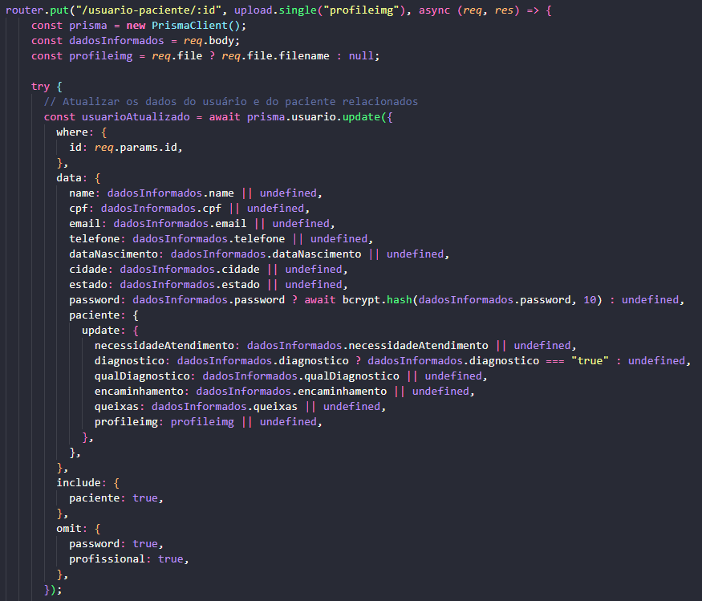

# Implementação do Backend da aplicação

O módulo backend da aplicação segue a arquitetura Cliente / Servidor. Sendo assim, nenhum script de comunicação com banco de dados é feito pelo lado Cliente, este por sua vez apenas faz requisições ao servidor que devem ser tratadas pelo módulo backend em questão.

## Principais características e tecnologias utilizadas no backend

* Foi utilizada a linguagem de programação **Javascript com Node.js** para tornar possível sua utilização no backend.

* Toda a parte de roteamento e configuração da API foi desenvolvida com base no **Framework Express.js**

* O backend é distribuído e desacoplado do frontend da aplicação. Seu acesso se baseia em uma API Rest que se comunica por rotas específicas.

* A comunicação com a API se faz através de requisições HTTP com determinados verbos para cada tipo de rota.

* Certas rotas da aplicação são **Públicas** ou **Privadas**. As rotas públicas são invocadas pelo arquivo **"public_routes.js"** enquanto as privadas são invocadas pelo arquivo **"public_routes.js"**. Abaixo um exemplo das rotas organizadas desta forma nos arquivos do código fonte:

 

* A autenticação das rotas privadas é feita através de um middleware chamado **"auth.js"**. Sua função é validar o Token JWT informado no cabeçalho da requisição HTTP. Apenas com esse Token válido é possível acessar rotas privadas, caso contrário a API retorna status 401 - Não autorizado. Abaixo um exemplo da chamada principal da API. Enquanto as rotas públicas são invocadas diretamente após sua chamada, as privadas tem o arquivo **auth** como intermediário.

* O sistema utiliza a biblioteca BCrypt na qual criptografa as senhas dos usuários antes de registrá-las no banco de dados. Ao efetuar Login, a biblioteca faz uma comparação do Hash da senha digitada com a senha cadastrada para um e-mail específico de usuário.

* O sistema conta com uma funcionalidade de upload de imagem de perfil ao se cadastrar uma especialização do usuário. Por conta da limitação de orçamento e a impossibilidade de upload de imagens diretamente no Vercel, plataforma escolhida para o Deploy, o upload das imagens é feito de forma independente para o Google Drive, através da API disponibilizada pelo fabricante. O tratamento deste envio é feito pela biblioteca **"Multer"**, no arquivo **"multer.js"** que carrega diversas configurações e comunicações com a Google Drive API. As credenciais de acesso são carregadas pelo arquivo **"credentials.json"** e por variáveis de ambiente no arquivo **".env"** que foram inseridas no Vercel no momento do Deploy. O nome do arquivo das imagens recebe o Timestamp atual + o nome do arquivo original, de forma a evitar conflitos com nomes repetidos. Abaixo um trecho demonstrando a configuração da Google Drive API:

* A resposta da Google Drive API, quando uma imagem é enviada com sucesso, é o ID do arquivo, este é salvo no banco de dados no qual pode ser recuperado pelo frontend acrescido da URL base utilizada pela plataforma. O link completo para a imagem é: **https://drive.google.com/file/d/ID_DA_IMAGEM_RETORNADO_PELA_API**. Abaixo um exemplo da pasta que recebe as imagens com alguns testes:

## Rotas da API

Como o deploy foi feito utilizando o Vercel, este gera uma URL padrão para o projeto, que neste caso é **https://app-api-six.vercel.app/**. Após a "/" são inseridas as rotas específicas para consumo da API.

### Rota para Homepage (pública)

**/**

**Método HTTP "GET"**

Esta é a rota inicial da aplicação, não retorna qualquer conteúdo. Ao tentar acessar pelo método GET é retornado um Json com a mensagem "não autorizado".

### Rota para Cadastro (pública)

**/cadastro**

**Método HTTP "POST"**

Rota para cadastro de usuário que recebe diversos dados referentes ao perfil base do usuário. Ao cadastrar com sucesso, a rota retorna uma mensagem de sucesso e o ID do usuário cadastrado, essa informação deve alimentar as rotas de **/cadastro-profissional** ou **/cadastro-paciente**.
Codificação da rota:

### Rota para Cadastro de Profissional (pública)

**/cadastro-profissional**

**Método HTTP "POST"**

Rota para cadastro da especificação do usuário Profissional.
Codificação da rota:

### Rota para Cadastro de Paciente (pública)

**/cadastro-paciente**

**Método HTTP "POST"**

Rota para cadastro da especificação do usuário Paciente.
Codificação da rota:

### Rota para Login (pública)

**/login**

**Método HTTP "POST"**

Rota para autenticação do usuário. Se feito com sucesso, nela é gerado o Token JWT válido por 1 hora que é respondido pela API.
Codificação da rota:

### Rota para Listagem de profissionais (privada - Requer token JWT válido)

**/list-profissionais**

**Método HTTP "GET"**

Rota para listar profissionais disponíveis. Nela foi implementada um sistema de filtros por querys, será filtrado no frontend cidade e estado do profissional.
TRECHO da Codificação da rota:

### Rota para Listagem de pacientes (privada - Requer token JWT válido)

**/list-pacientes**

**Método HTTP "GET"**

Rota para listar pacientes disponíveis. Nela foi implementada um sistema de filtros por querys, será filtrado no frontend cidade e estado do paciente.
TRECHO da Codificação da rota:

### Rota para alterar profissionais (privada - Requer token JWT válido)

**/usuario-profissional/ID_DO_USUARIO**

**Método HTTP "PUT"**

Rota para alterar os dados do perfil de um profissional.
Codificação da rota:

### Rota para alterar pacientes (privada - Requer token JWT válido)

**/usuario-paciente/ID_DO_USUARIO**

**Método HTTP "PUT"**

Rota para alterar os dados do perfil de um paciente.
TECHO da Codificação da rota:

### Rota para deletar usuários (privada - Requer token JWT válido)

**/usuario-delete/ID_DO_USUARIO**

**Método HTTP "DELETE"**

Rota para deletar usuários. Ao inserir o ID do usuário na rota, sendo profissional ou paciente, as tabelas são deletadas em cascata. É retornado uma mensagem de sucesso junto do e-mail do usuário em questão, dado esse que é único nas tabelas, assim como o ID.
TECHO da Codificação da rota:

