# Planos de Testes de Software

## Fazer Login: 

Entrar com: email e senha.

- Login realizado com sucesso! Usuário paciente: direcionado para a página que lista profissionais cadastrados e usuário profissional: direcionado para a página que lista pacientes.
  
<a href="img/Login.jpeg">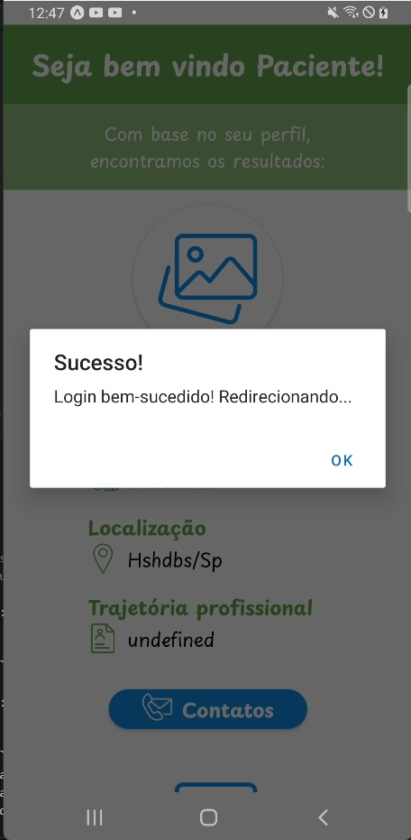</a>

- Não tem cadastro? Clicar em cadastrar.

## Fazer Cadastro: 

### Cadastro Geral:

Entrar com: nome completo, CPF, Email, Telefone, Data de nascimento, Cidade, Estado, Senha. Mensagem: Atenção preencha todos os campos.
- Cadastro realizado com sucesso! Usuário direcionado para segunda etapa do cadastro.
- Erro: Nenhuma resposta do servidor ou erro ao configurar requisições.

### Cadastro Paciente: 

Escolher necessidade do atendimento: Valor Social ou Voluntário.
Diagnóstico: escolher sim ou não. 
Se sim, descrever o diagnóstico.
Escolher tipo de encaminhamento: Escola, Médico ou Psicólogo.
Se tiver queixas descrevê-las.
Inserir uma foto de perfil.
- Cadastro finalizado com sucesso! Usuário é direcionado para a tela de login.
- Erro: Nenhuma resposta do servidor ou erro ao configurar requisições.

  <a href="img/CadatroFinalizado.jpeg">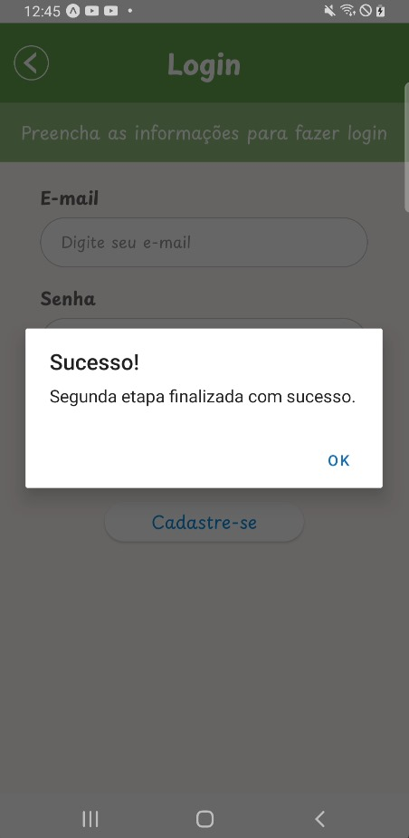</a>

### Cadastro Profissional: 

Escolher entre o tipo de atendimento: Valor Social ou Voluntário.
Descrever a trajetória profissional.
Inserir uma foto de perfil.
- Cadastro realizado com sucesso! Usuário é direcionado para a tela de login.
- Erro: Nenhuma resposta do servidor ou erro ao configurar requisições.
  
## Fazer Login: 

Entrar com email  e senha.
Login realizado com sucesso: usuário paciente direcionado para tela que lista profissionais cadastrados e usuário profissional direcionado para tela que lista pacientes cadastrados.

## Alterar Perfil Paciente: 

Os campos que podem ser alterados (nome, telefone, data de nascimento, cidade, estado, necessidade do atendimento, diagnóstico, encaminhamento e queixas) são carregados na tela para que o usuário possa alterá-los.
- Dados alterados com sucesso! Usuário direcionado para página que lista profissionais.
- Erro: Não foi possível salvar as alterações.
Nessa página também é possível excluir o perfil: clicar no botão excluir.

### Excluir perfil
Mensagem: Certeza que deseja excluir seu perfil? Ok ou cancelar.
- Perfil excluído com sucesso! Usuário encaminhado para a página de login.
- Erro ao excluir o perfil! Mensagem: Não foi possível excluir seu perfil.

## Alterar Perfil Profissional: 

Os campos que podem ser alterados (nome, telefone, data de nascimento, cidade, estado, tipo de atendimento e trajetória profissional) são carregados na tela para que o usuário possa alterá-los..
- Dados alterados com sucesso! Usuário direcionado para página que lista pacientes.
- Erro: Não foi possível salvar as alterações.
Nessa página também é possível excluir o perfil: clicar no botão excluir.

### Excluir perfil
Mensagem: Certeza que deseja excluir seu perfil? Ok ou cancelar.
- Perfil excluído com sucesso! Usuário encaminhado para a página de login.
- Erro ao excluir o perfil! Mensagem: Não foi possível excluir seu perfil.

 
# Evidências de Testes de Software

## Prints das telas durante os testes: 

- Login realizado com sucesso:

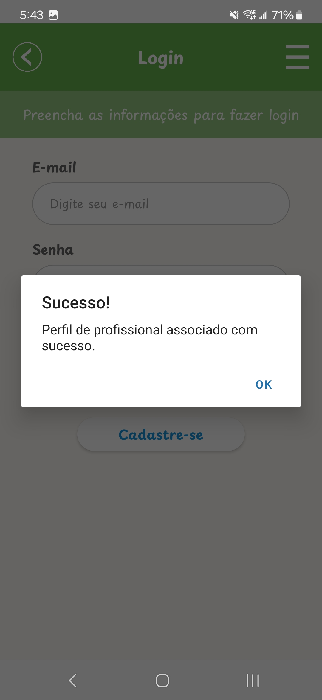

- Login realizado com sucesso: usuário sendo direcionado:

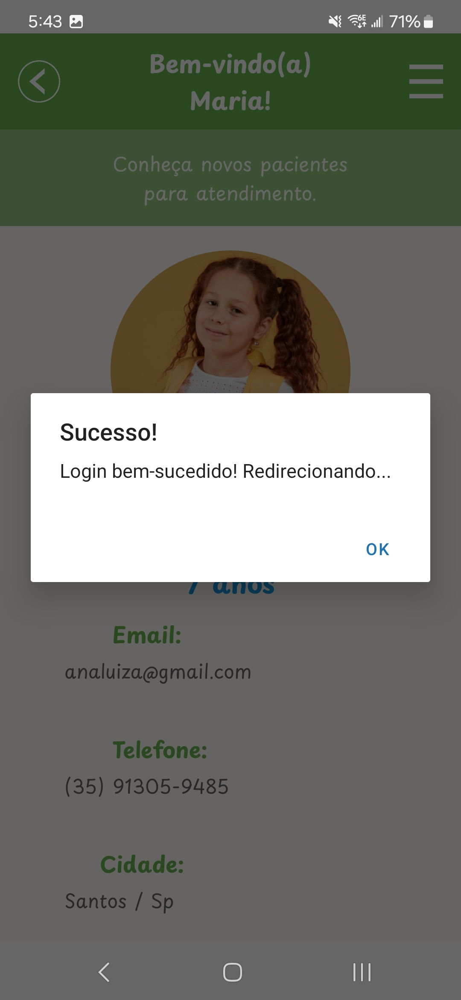

- Etapa 1 do cadastro finalizada.

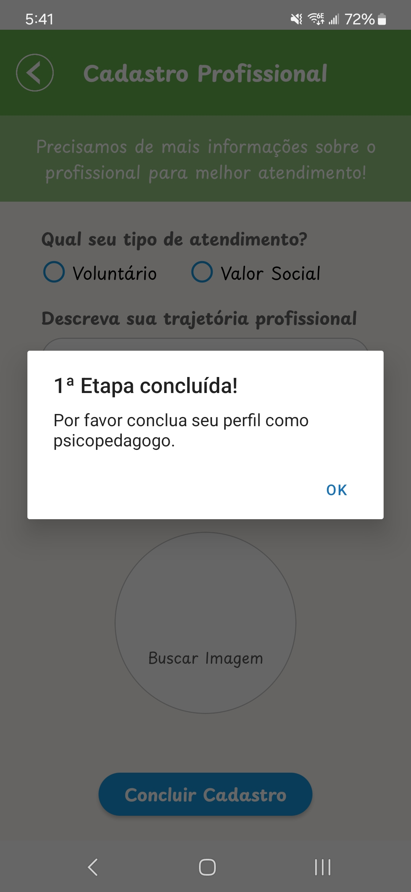

- Erro ao cadastrar:

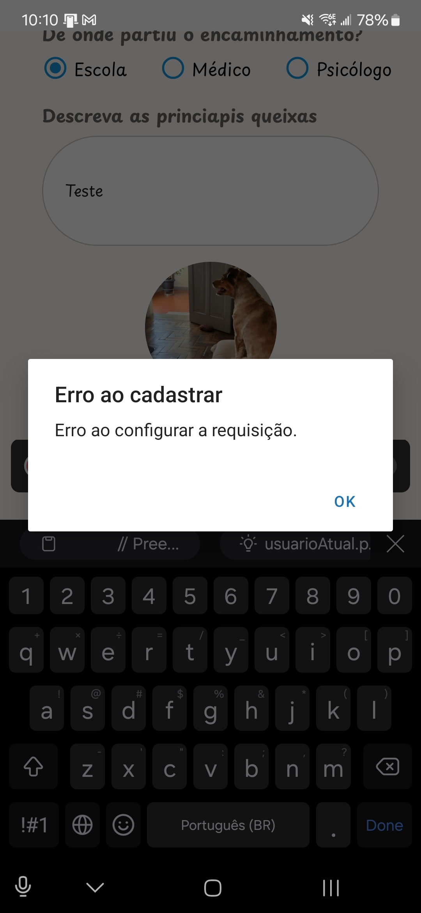

- Lista pacientes:

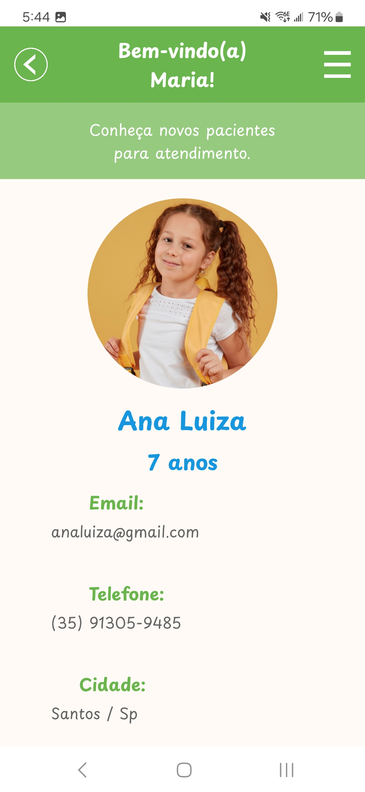
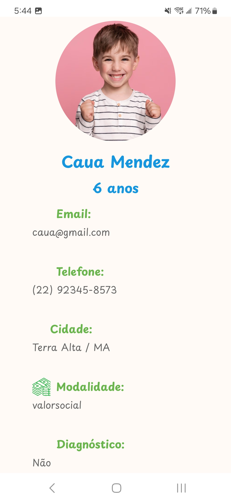

- Lista profissionais: 

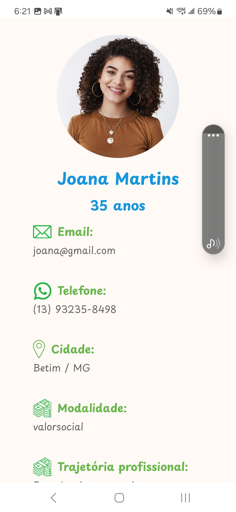

- Alterar perfil paciente:

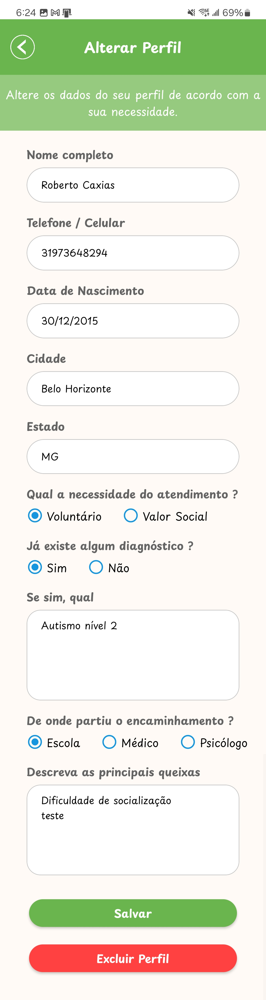

- Alterar perfil profissional:

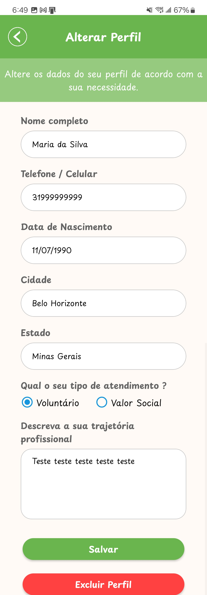

- Perfil atualizado com sucesso:

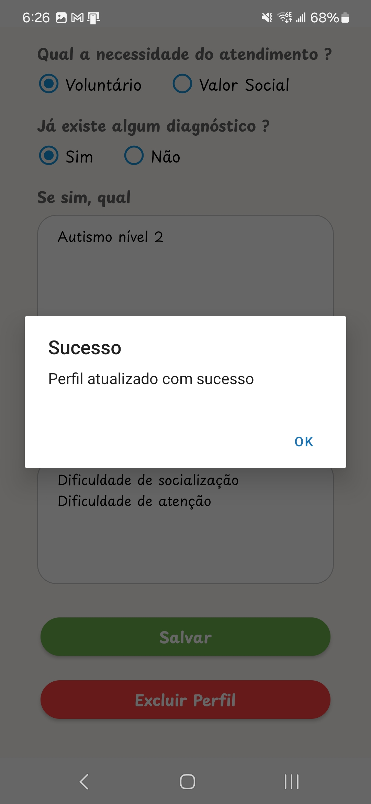
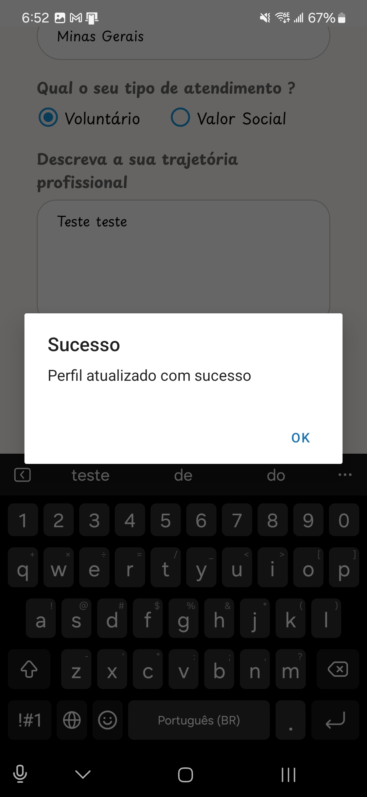

- Excluir perfil:

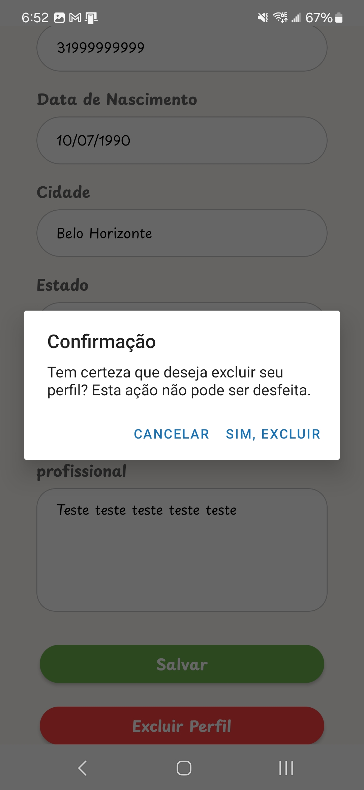

- Perfil excluido com sucesso:

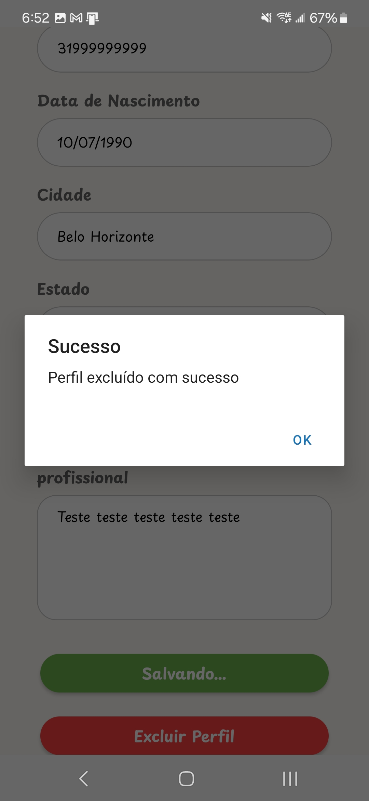

