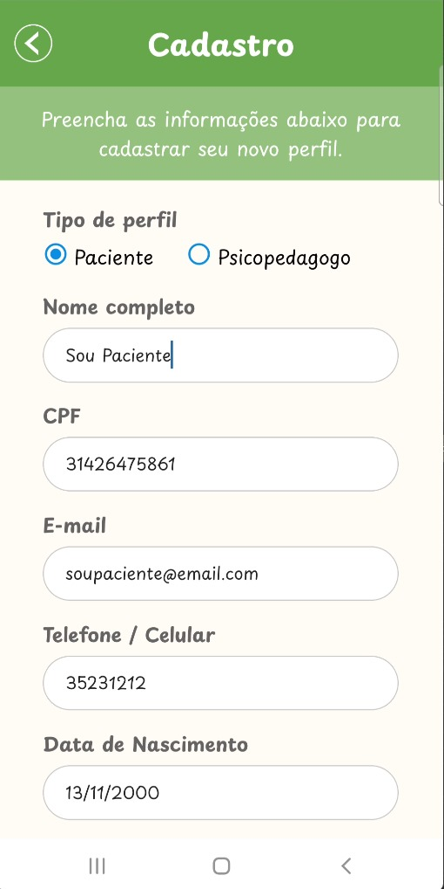

# Planos de Testes de Software
# Evidências de Testes de Software

## Fazer Login: 

1- Acessar a aplicação.

2- Entrar com: email e senha.

Respostas esperadas: 

- Login realizado com sucesso! Usuário paciente é direcionado para a página que lista profissionais cadastrados e o usuário profissional é  direcionado para a página que lista pacientes.
  

- Não tem cadastro? Clicar em cadastrar.

## Fazer Cadastro: 

O cadastro é feito em duas etapas: primeiro um cadastro geral e depois a finalização do cadastro com características personalizadas para cada tipo de usuário ( profissional e paciente).

### Cadastro Geral:

1- Escolher o tipo de perfil: profissional ou usuário.

2- Entrar com: nome completo, CPF, email, telefone, data de nascimento, cidade, estado.
3- Criar uma senha. 

Respostas esperadas: 

Se o usuário não preencher todos os campos: 

- Mensagem: Atenção preencha todos os campos!

Se o usuário preencher todos os campos corretamente: 

- Cadastro realizado com sucesso! Usuário direcionado para segunda etapa do cadastro conforme o perfil selecionado.

- Erro: Nenhuma resposta do servidor ou erro ao configurar requisições.

### Cadastro Paciente: 

**Pré-condição** : para realizar essa etapa é necessário que o usuário tenha realizado a primeira etapa com sucesso.

1- Escolher necessidade do atendimento: Valor Social ou Voluntário.

2- Diagnóstico: escolher sim ou não. 

3- Se o usuário escolher sim na etapa acima, descrever o diagnóstico.

4- Escolher tipo de encaminhamento: Escola, Médico ou Psicólogo.

5- Se tiver queixas descrevê-las.

6- Inserir uma foto de perfil.

Respostas esperadas:

- Cadastro finalizado com sucesso! Usuário é direcionado para a tela de login.

  
- Erro: Nenhuma resposta do servidor ou erro ao configurar requisições.

### Cadastro Profissional: 

**Pré-condição** : para realizar essa etapa é necessário que o usuário tenha realizado a primeira etapa com sucesso.

1- Escolher entre o tipo de atendimento: Valor Social ou Voluntário.

2- Descrever a trajetória profissional.

3- Inserir uma foto de perfil.

Respostas esperadas:

- Cadastro realizado com sucesso! Usuário é direcionado para a tela de login.
- Erro: Nenhuma resposta do servidor ou erro ao configurar requisições.
  
## Fazer Login: 

**Pré-condição** : para fazer o login é necessário que o usuário tenha realizado o cadastro completo com sucesso.

1- Entrar com email  e senha.

Resposta esperada:

 Login realizado com sucesso: usuário paciente direcionado para tela que lista profissionais cadastrados e usuário profissional direcionado para tela que lista pacientes cadastrados.

  
 
 

## Alterar Perfil Paciente: 

**Pré-condição** : para alterar o cadastro é necessário que o usuário esteja logado.

1- Os campos que podem ser alterados (nome, telefone, data de nascimento, cidade, estado, necessidade do atendimento, diagnóstico, encaminhamento e queixas) são carregados na tela para que o usuário possa alterá-los.

2- Alterar os dados desejados.

3- Clicar em salvar.

Respostas esperadas:

- Dados alterados com sucesso! Usuário direcionado para página que lista profissionais.
- 

- Erro: Não foi possível salvar as alterações.

Nessa página também é possível excluir o perfil ao clicar no botão excluir.

### Excluir perfil

**Pré-condição** : para excluir o cadastro é necessário que o usuário esteja logado.

1- Clicar no botão excluir.

Resposta: Mensagem: Certeza que deseja excluir seu perfil? Ok ou cancelar.

2- Clicar em ok.

Respostas esperadas: 

- Perfil excluído com sucesso! Usuário encaminhado para a página de login.
- Erro ao excluir o perfil! Mensagem: Não foi possível excluir seu perfil.
  
3- Clicar em cancelar.

Resposta: o perfil não é excluído. 

## Alterar Perfil Profissional: 

**Pré-condição** : para alterar o cadastro é necessário que o usuário esteja logado.

1- Os campos que podem ser alterados (nome, telefone, data de nascimento, cidade, estado, tipo de atendimento e trajetória profissional) são carregados na tela para que o usuário possa alterá-los.

2- Alterar os dados desejados.

3- Clicar em salvar.

Respostas esperadas:

- Dados alterados com sucesso! Usuário direcionado para página que lista pacientes.
- Erro: Não foi possível salvar as alterações.
  

  
Nessa página também é possível excluir o perfil ao clicar no botão excluir.

### Excluir perfil

**Pré-condição** : para excluir o cadastro é necessário que o usuário esteja logado.

1- Clicar no botão excluir.

Resposta: Mensagem: Certeza que deseja excluir seu perfil? Ok ou cancelar.

2- Clicar em ok.

Respostas esperadas: 

- Perfil excluído com sucesso! Usuário encaminhado para a página de login.

- Erro ao excluir o perfil! Mensagem: Não foi possível excluir seu perfil.
  
3- Clicar em cancelar.

Resposta: o perfil não é excluído. 

 

